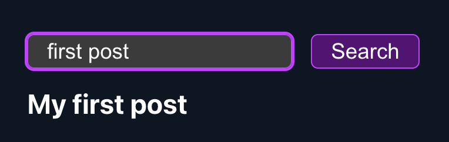

# Next.js Search Query

This is a simple Next.js app that implements a search query using Next.js API routes

## Live Demo

- [https://nextjs-search-query.vercel.app/](https://nextjs-search-query.vercel.app/)

#### Screenshot

## Getting Started

- clone the repo and `cd` into the directory
- run `npm install` to install dependencies
- run `npm run dev` to start the development server

## How it works

The search query is implemented in 3 steps:

- A json file at the root of the project called `posts.json` that contains an array of posts with their id and title
- An API route that accepts a query parameter and returns the matching posts from the `posts.json` file
- A search component that uses fetch to call the API route and displays the results

## How to use

- Open the app in your browser
- Type in the search bar the post title that you need to search and click on the search button
- The results will be displayed below the search bar

> Note: Check `posts.json` to see the available post titles
>
> EXAMPLE SEARCHES: `"first post"`, `"post"`, `""`

## License

- [MIT](LICENSE.md)
